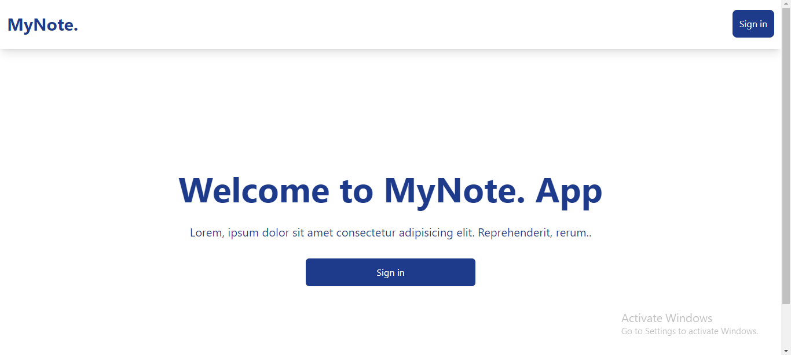

# My Note App

This is a project I embarked on to build a note application. Hope you Like it.

## Table of Content
- [Overview](#overview)
  - [Screenshot](#screenshot)
  - [Links](#links)
  - [Setting up](#setting-up)
- [My process](#my-process)
  - [Built with](#built-with)
  - [What I learned](#what-i-learned)
  - [Packages and Technologies](#packages-and-technologies)
  - [Useful resources](#useful-resources)
- [Author](#author)

## Overview

### Screenshot


### Links
- **Live Site URL** [@Vercel](https://mynote-coral.vercel.app/)
- **Solution URL**
[@Github](https://github.com/John-developer-18/mynote)

### Setting up
>To set this app up, follow the steps below:

Clone  the repo to your local machine
```bash
git clone https://github.com/John-developer-18/johnfalana.git
```
Then serve the app
```
npm run dev
```


## My process

### Built With
- Semantic HTML5 markup
- CSS custom properties
- [Tailwind CSS](https://tailwindcss.com/docs/installation)
- Flexbox and Grid layout for responsive design
- Mobile-first approach in development
- React.JS
- [Vite](https://vitejs.dev/)

### What I learned

- useState Hook
- Conditional rendering
- Using React Scroll
- Using React Reveal
- Using React Icons
- Firebase and FireStore

### Packages and Technologies

- [Tailwind CSS](https://tailwindcss.com/docs/installation)
- [Vite](https://vitejs.dev/)
- [React Scroll](https://www.npmjs.com/package/react-scroll)
- [React Icons](https://react-icons.github.io/react-icons/)
- [React Route Dom](https://www.npmjs.com/package/react-router-dom)
- [React Reveal](https://www.npmjs.com/package/react-reveal)

### Useful resources

- [ChatGPT](https://chat.openai.com/)
- I will add more later

## Author
- Website - [@John Falana](https://johnfalana.vercel.app/)
